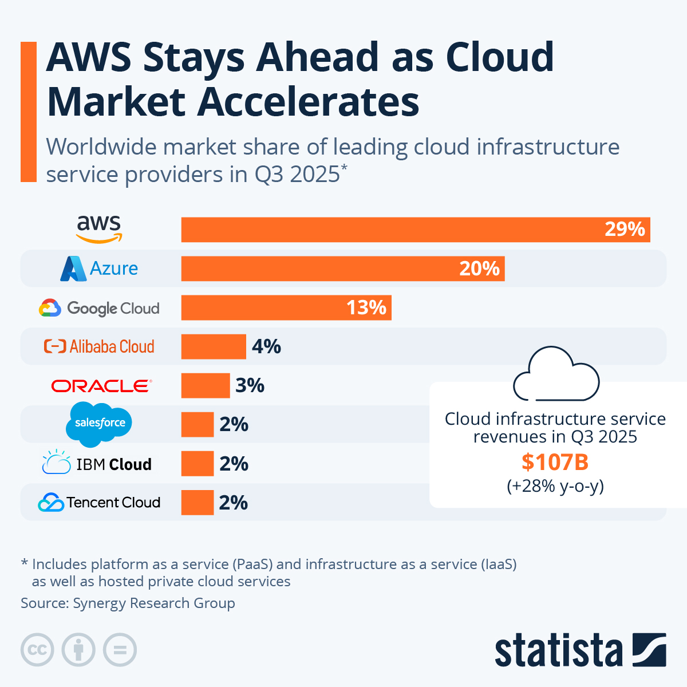

### How AWS started
	- **Amazon built AWS from solving its *own* internal scaling problems​**
		- Wanted to create a shared infrastructure in order solve IT scaling issues-focus on customers, not infastructure
		  id:: 691ba190-afb3-4db6-8e8c-13906189fe76
		- AWS launched developer platform in 2002 and experienced strong demand \rarr Developers were hungry for more
	- **Needed faster, cheaper, more flexible IT infrastructure​**
	- **2004: AWS launched the first public product- Simple Queue service​**
	- **2006: AWS officially launched S3 (Storage) and EC2 (Computing)​**
	- **Goal: Give anyone access to enterprise-grade technology​**
	- **Early success with startups, then huge enterprises​**
- ### AWS Inside Amazon
	- **AWS powers the entire Amazon retail website​**
	- **Supports logistics, inventory, fulfillment, Prime Video​**
	- **Enables Amazon to handle huge traffic spikes (Prime Day, holidays)​**
	- **Lowers Amazon’s technology costs**
		- ((691ba190-afb3-4db6-8e8c-13906189fe76)) ​
	- **Provides fast deployment for new features and services​**
- ### AWS as a Global Business
	- {:height 634, :width 427}
	- **$100B+ annual revenue — Amazon’s largest profit generator​​**
	- **30+ global regions, 100+ Availability Zones​**
	- **200+ cloud services: compute, storage, AI/ML, IoT, databases​**
	- **Clients include Netflix, Disney+, NASA, Airbnb, and the U.S. government**
		- When AWS goes down (as we saw in October) can cause widespread issues throughout the internet
		- ​
- ### AWS and Amazon's Strategic Power
	- **AWS gives Amazon a dual moat: tech + profits​**
	- **High switching costs make customers stay**​
		- And competitive pricing with other providers encourages customer loyalty
	- **Enables Amazon to innovate faster than competitors​**
	- **Funds Amazon’s expansions (AI, robotics, logistics, retail)**​
	- **Strengthens market dominance in both cloud and e- commerce​**
- ### Recent Innovations (2024–2025)​
	- **Amazon Bedrock: Generative AI platform for businesses​**
	- **Titan AI models integrated across Amazon services​**
	- **New data centers + “Local Zones” for low-latency cloud​**
	- **Sustainability commitment: 100% renewable energy​**
	- **Cloud tools for e-commerce, supply chain, and automation​**
	- Also not necessarily an innovation but continued growth in the governmental data storage sector
- ### Conclusion / Takeaways​
	- **AWS started as internal infrastructure, became global cloud leader​**
	- **Supports Amazon’s core retail operations​**
	- **Drives Amazon’s profit and innovation​**
	- **Creates long-term strategic advantage in cloud, AI, and global commerce​**
	- **AWS = a major example of how Information Systems create platform power​**