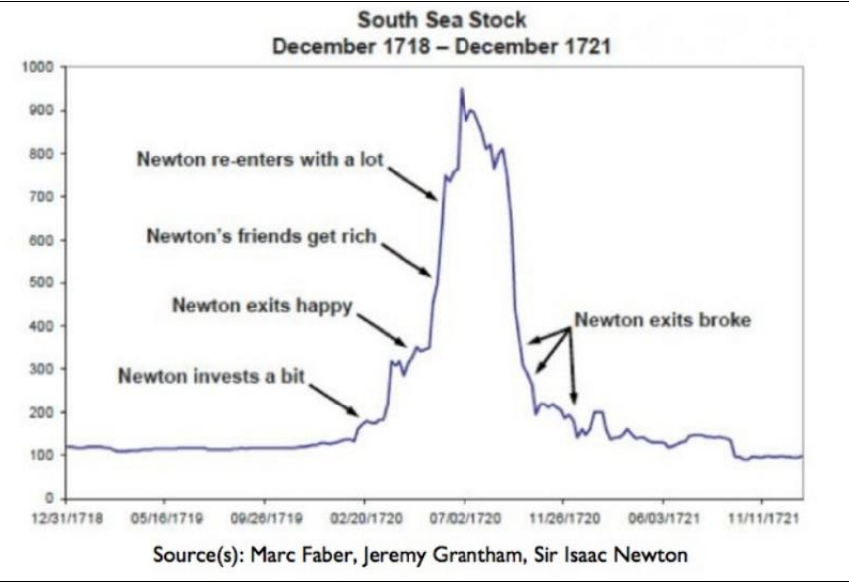

### Example behavioral finance graph
- #+BEGIN_QUOTE
  "I can calculate the motions of the heavenly bodies, but not the madness of men."
  #+END_QUOTE
- {:height 354, :width 414}
- # Cognitive errors & emotional biases
- ## Cognitive errors
- ### Belief Perseverance (Core)
	- #### Description
		- Tendency to maintain a belief despite evidence that contradicts your beleif
	- #### Example
		- Continuing belief in the honestly of a political candidate after clear evidence of corruption
- ### Confirmation Bias
	- #### Description
		- Seeking, interpreting, recalling information in a way that confirms pre-existing beliefs but ignoring conflicting data
	- #### Example
		- Smoker only reading studies that downplay the health risks of smoking
- ## Conservatism bias
	- #### Description
		- Insufficiently revising beliefs in response to new evidence-sticking too closely to priors
	- #### Key examples
		- An investor slightly downgrading a stock despite strong negative signals
		- Favoring traditional candidates
		- Keeping a feature in a product that users do not like/or isn't working
- ## Representativeness bias
	- #### Description
		- Judging probability by similarity to a prototype, ignoring base rates or disconfirming evidence
	- #### Key examples
		- Assuming a shy person is a librarian, not a salesperson despite base-rate odds
		- Judging people based on their appearance
- ## Illusion of Control Bias
	- #### Description
		- Overestimating one's ability to control or influence outcomes that are actually determined by chance or external factors-reinforcing belief in personal theories despite evidence of randomness
	- #### Key examples
		- A gambler believing they can "will"  a slot machine win or that rituals improve luck, even after repeated losses
			- Or continuing to gamble believing that you will eventually win even though it is statistically unlikely
- ## Hindsight Bias
	- #### Description
		- Tendency to see past events as having been predictable (I knew along) after they occur, reinforcing overconfidence in initial beliefs and resisting revision
	- #### Key example
		- After a market crash- "I knew it was going to crash", even if the pre-crash predictions were optimistic
- ## Processing Errors
- ## Anchoring and Adjustment Bias
	- #### Description
		- Over-relying on the first piece of information (the anchor) when making decisions, the insufficiently adjusting from it
	- #### Key example
		- Asked "Is the Mississippi River longer than 500 miles?" then estimating 600 miles; if asked "longer than 5,000 miles?", estimating 4,000 miles—even though actual length is —2,300 miles.
- ## Mental Accounting bias
	- #### Description
		- Treating money differently depending on its source, intended use, or mental account, rather than fungibility
	- #### Key example
		- Refusing to use a $100 tax refund for groceries (seen as "extra") but freely spending $100 from salary; or keeping a "vacation fund" separate from daily expenses.
- ## Framing bias
	- #### Description
		- Making different decisions based on how information is presented (gain vs loss frame), even if objective facts are identical
	- #### Key example
		- 95% survival rate → people choose surgery; 5% mortality rate → people avoid it—even though both mean the same outcome.
- ## Availability Bias
	- #### Description
		- Judging likelihood or frequency by how easily examples come to mind, rather than actual data
	- #### Key example
		- After seeing news about shark attacks, overestimating the risk of swimming; or fearing plane crashes more than car accidents due to vivid media coverage.
- ## Behavioral biases
- ## Loss-Aversion Bias
	- #### Description
		- The pain of a loss is twice as much as the pleasure of a similar gain; therefore we prefer to avoid losses over acquiring gains
	- #### Key example
		- Reusing to sell a stock down $1,000 in order to avoid realizing the loss, but not buying more of the stock when it is up $1,000
- ## Disposition effect
	- #### Description
		- Selling winning investments to soon in order to lock in gains, and holding losing investments too long to avoid realizing losses
	- #### Key example
		- An investor quickly sells a stock up 20% but holds one down 20% hoping it comes back
- ## Overconfidence Bias
	- #### Description
		- Overestimating one's own knowledge, predictive ability, or control over outcomes
	- #### Key example
		- A trader believing they can beat the market consistently despite average returns; or a driver claiming "I'm above average" (statistically impossible for most).
- ## Self-Control bias
	- #### Description
		- Prioritizing short-term gratification over long term goals due to impulsivity and a lack of discipline
	- #### Key example
		- Spending a bonus on a luxury item instead of saving for retirement
		- Eating dessert despite a diet plan
- ## Status Quo bias
	- #### Description
		- Preferring things to stay the same
		- Resisting change even when a new option is better
	- #### Key example
		- Refusing to sell a family heirloom for $5,000 even though you wouldn't buy it for a lower amount
- ## Regret-Aversion bias
	- #### Description
		- Avoiding decisions that might lead to regret, even if rationally optimal
		- Fear of being wrong
	- #### Key example
		- Not investing in a stock that later surges or not selling a stock that crashes