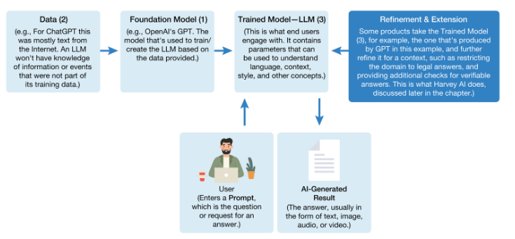

# 18.2 Generative AI: Whoa—This Is Something Different!
- AI has been around for many years
	- Goal of AI is to create computer programs able to mimic and improve on human intelligence
- ChatGPT 3.5 release in fall 2022 accelerates AI
	- Most user-accessible version of AI
	- First real accessible **generative AI** (to the general public)
	- Gen AI **prompted** by user
	- Can also make up wrong answers and provide them to a the user-**Hallucination**
	  id:: 690714b0-3dfe-46d2-aa81-7558963505a2
	- Public release of ChatGPT controversial and created a debate on the consequences of AI
	- OpenAI investment increases dramatically after the release of ChatGPT (Microsoft)
- # 18.3 So How Does This Stuff Really Work? A Manager’s Guide to Understanding GenAI
- 
- **Corpus** data used to train a model
- **Supervised learning** - supervised training by providing specific result examples
- **Self-Supervised learning** - data is not explicitly labeled and results are not preditermined
	- Humans examine LLM feedback at many major firms
-
- #
- # 18.4 Generative AI: Changing Products and the Nature of Work Itself
- Generative AI synthesizes information in large organizations, helps with creative work and brainstorming, etc.
	- Also helps with education, training, quality improvement
- Real time coding assistant
	- Pair programming improved
- Graphic design work
- Office productivity tools
	- New Office 365
- Accounting
	- Help corporate tax departments
- Legal Work
	- Goldman Sachs predicts that AI might make up 44% of legal work
	- Could have an issue where AI cites cases that do not exist (Hallucination)
-
- #
- # 18.5 Understanding AI Risks
- Developing rapidly
- Could be issues with the data that is fed into AI
	- **Prompt injection**
	- **data poisoning**
- Bias with the technology
- Hallucinations
	- ((690714b0-3dfe-46d2-aa81-7558963505a2))
- Ethical implications
	- Students using AI and passing it off as their own
	- Journalists passing off AI-generated content as their own
- Can cause harm
- Copyright and AI is uncertain
- Job loss
- Scale of AI concentrates power and carries enviromental impact
	- Can be destructive
- Could maybe not understand how it is operating
- # 18.6 It’s Not as Easy as the Press Might State: Technical, Organizational, Legal, and Societal Challenges of AI and Machine Learning
- Issues that managers might encounter with AI
	- Data quality- inconsistent data
	- Data security
	- Not enough data
	- Training required to manage AI
	- Identify processes that need to be changed
	- Machine learning types that are legally prohibited
	- Unintended consequences of data misuse might lead to regulation and limits on technology
	- Additional privacy issues as the increased amount of communication
	- Certain firms may be able to gain advantage in the market and therefore collect more data -> Generate data -> Create predictions
-
- #
- # 18.7 Addressing AI Risks and Building More Responsible Technology
- Increased oversight of ethical challenges and artificial intelligence
- ## Steps in developing more ethical, less risk-prone systems
- Hire diversely
- Hire ethicists
- Develop a code of technology ethics
- Create a systems review board
- Create and enforce technology audit trails
- Partner to build better technology
- Partner to build better technology
- Develop and refine clear employee policies
- Implement strong tech and procedural training programs
- Gather and act on input regarding flaws
- Provide a means for remediation
- Test and audit
- Continually evaluate best practices and incorporate proven techniques
- Roll out new technology gradually