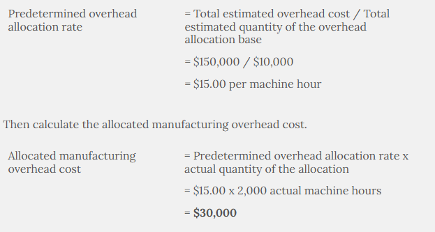

- #+BEGIN_EXAMPLE
  In a company where manufacturing overhead is applied based on machine hours, the predetermined allocation rate is $3 per machine hour. Actual machine hours were 3,000 and actual manufacturing overhead was $8,000.
  
  Is overhead underallocated or overallocated and by how much?
  #+END_EXAMPLE
	- 1,000 overallocated
- #+BEGIN_EXAMPLE
  Jones Company is a consulting firm and applies indirect overhead costs based on billing hours. The firm expects to have $75,000 in indirect costs during the year and bill customers for 7,500 hours. The cost of direct labor is $55 per hour.
  
  What is the predetermined overhead allocation rate for Jones Company?
  #+END_EXAMPLE
	- 10 per hour
- #+BEGIN_EXAMPLE
  When direct materials are used in production, costs are assigned by debiting Work-In-Process Inventory and crediting ________.
  #+END_EXAMPLE
	- Raw materials inventory
- #+BEGIN_EXAMPLE
  The cost of goods manufactured for the period is $100,000.  
  
  The journal entry to record the transfer of the finished goods to a storage area before being sold would be:
  #+END_EXAMPLE
	- |Date|Accounts|Debit|Credit|
	  |--|--|--|--|
	  |   | Finished Goods Inventory | 100,000 |   |
	  |   | Work-in-Process Inventory |   | 100,000 |
	- The journal entry to record goods that are finished but not yet sold is **a debit to Finished Goods and a credit to Work-in-Process Inventory** for the cost of goods manufactured.
- #+BEGIN_EXAMPLE
  Brooks Company is a consulting firm and applies indirect overhead costs based on billing hours. The firm expects to have $75,000 in indirect costs during the year and bill customers for 750 hours. The cost of direct labor is $55 per hour.
  
  Brooks Company completed a consulting job for George Peterson and billed the customer for 15 hours. What was the total cost of the consulting job?
  #+END_EXAMPLE
	- The predetermined allocation rate is equal to estimated indirect labor costs/estimated billing hours = $75,000/750 = $100 per hour
	- Amount billed is equal to (direct labor cost per hour + $100 per hour for indirect costs) x 15 hours $2,325 = ($100 + $55) x 15 hours
- #+BEGIN_EXAMPLE
  Jones Company has an overallocated amount of $2,000 after balancing the Manufacturing Overhead account.
  
  The debit entry to close out the overallocated amount would be ________.
  #+END_EXAMPLE
	- Manufacturing overhead
- #+BEGIN_EXAMPLE
  White Company manufactures furniture. Assume the following information:
  
                  
  
  Manufacturing overhead is allocated based on machine hours.
  Manufacturing overhead is estimated to be $150,000 and machines hours are expected to be 10,000 hours.
  The actual manufacturing overhead is $31,000 and there are 2,000 actual machine hours.
  How much manufacturing overhead would White Company allocate?
  #+END_EXAMPLE
	- 
- #+BEGIN_EXAMPLE
  Cost of Goods Sold is considered what type of account?
  #+END_EXAMPLE
	- Equity-expense account
	-
- #+BEGIN_EXAMPLE
  Acme Consulting uses job order costing to determine the cost of services provided to clients.
  
  For a particular year, Acme has budgeted the following amounts:
  The firm has completed job 101 for a client. Job 101 involved 25 hours of direct labor. Acme assigns indirect costs based on direct labor hours. What is the cost of job 101?
  #+END_EXAMPLE
	- | Office rent and utilities | $100,000 |
	  | Support staff | $70,000 |
	  | Advertising | $25,000 |
	  | Supplies | $5,000 |
	  | Direct labor (based on 2.000 hours)  | $120,000 |
- #+BEGIN_EXAMPLE
  The journal entry to allocate manufacturing overhead costs to production would include a credit to ________.
  #+END_EXAMPLE
	- Manufacturing Overhead
- #+BEGIN_EXAMPLE
  Thompson Company is a consulting firm and applies indirect overhead costs based on billing hours. The firm expects to have $7,700 in indirect costs during the year and bill customers for 700 hours. The cost of direct labor is $60 per hour.
  
  Thompson Company completed a consulting job for Joe Lock and billed the customer for 20 hours. What was the total cost of the consulting job?
  #+END_EXAMPLE
	- Estimated indirect labor costs / Estimated hours
	- $11 per hour = $7,700/700