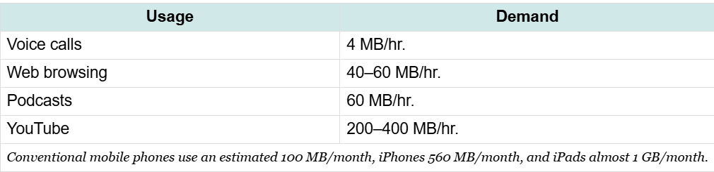

# Introduction
	- Internet is a business enabler
	- Marketers who have an understanding of the internet and its impact on consumers
	- Understanding how the internet works helps the manager to assess how their firms are vulnerable
		- Keep their organization constantly connecting
- # Internet 101: Understanding How the Internet Works
	- The internet is a network of networks
		- Your local network (intranet) connects to the Internet service provider to access the wider internet
		- There is no center to the internet, no one owns it
			- Therefore is extremely fault tolerant
			- Arose from military and education institutions work as far back as the 1960s
				- Took off in the 1990s when graphical browsing was invented
				- Architecture was then transitioned to private firms rather than government grants
		- 
	- ## The URL: “What Are You Looking For?”
		- **URL (uniform resource locator)** - Used interchangeably with "Web Address", URLs are used to identify resources on the Internet along with the application protocol needed to retrieve it
			- Basically used to tell your browser what you are looking for
		- #+BEGIN_EXAMPLE
		  The URL displayed really says, “Use the Web’s secure SSL protocol (https://) to find a host server named ‘www’ in the ‘nytimes.com’ network, look in the ‘tech’ directory, and access the ‘index.html’ file.”
		  #+END_EXAMPLE
		- 
		- **Hypertext transfer protocol** - Application transfer protocol that allows web browsers and Web servers to communicate with each other
			- Most sites now use https instead of http
				- Shift occurred aggressively several years ago
				- Warning shows up if not secure
				- https is achieved by using **SSL- Secure Sockets Layer**
					- SSL encrypts web transmissions so they can be securely sent between locations
					- **Does not mean that the transmission is totally secure-only the transmission from end to end is safe**
			- These protocols are designed to be independent from hardware
		- Other network protocols
			- **SMTP** - Simple mail transfer protocol
			- **FTP** - File Transfer protcol
	- ## Host and Domain names
		- URL holds host and domain names
			- Domain name - name of the network that you are trying to connect to
			- Host - The computer that you are looking for on that network
			- Main domains have lots of different hosts
				- Google's main website is served from www, but it also runs other hosts like finance.google.com
			- Popular websites have several computers to allow for load balancing and fault tolerance
				- One computer can have many host names
				- Might be the case if a firm is hosting several websites on a a single piece of computer hardware
					- [jackrschumacher.com](jackrschumacher.com) is the main domain
					- [uahnotes.jackrschumacher.com](uahnotes.jackrschumacher.com) is a subdomain
					- [astra.jackrschumacher.com](astra.jackrschumacher.com) is a subdomain
					- Can go deeper into subdomains
						- Up to 127 levels deep
		- Most websites are configured to load a default host, in most cases, www
		- Host domain names are not case sensitive
		- You can get your own domain name by going through a domain registrar
			- Registrars are accredited by ICANN (Internet Corporation for Assigning Names and Numbers)
				- Non-profit governance and standards-setting body
				- Each registrar may be granted the ability to registrar domain names in one or more top level domains
				- Some domain names limit registration
					- .edu, .mil
				- ICANN has also begun to allow people to propose, bin on and secure new top level domains (.berlin, .guru)
					- Stated that firms that secure the right to generic TLDs
					- Google and Amazon among others have paid a great deal for their own TLDs
				- Also ccTLDs for two-character country code country domains
					- .uk, .ca, .jp
					- You don't need to be in the country to register in the domain
				- Geographic TLDs can be associated with Geographical, geopolitical areas
					- .asia, .scot
				- **Cybersquatting**  -Knowingly registering a domain name that violates someone else's trademark
				- Can register lucrative domains and sell later on to corporations
				- Litigation can be difficult with domains
	- ## Path name and File name
		- Most web pages end in .html (Hypertext markup language)
		- HTML is used to create web pages
		- Web servers can deliver almost ay type of files
		- There is always a file behind the scenes even if you do not see it
		- Paths and file names are case-sensitive
	- ## IP Addresses and the Domain Name System: “Where Is It? And How Do We Get There?”
		- ### The IP Address
			- Every device connected to the internet has an IP adress
			- **IP address** - A value used to identify a device that is connected to the Internet. IP addresses are usually expressed as four numbers (from 0 to 255), separated by periods.
			- The internet provider "lends" a device an IP address
			- The original IP address standard was IPv4 - expressed as a string and 0 and 255
				- We have run out of IPv4 addresses
					- Ways to address this through **Network Address Translation**  - Uses a gateway that allows multiple devices to share a single IP address
					- However, to truly solve this issue, we must switch to IPv6, but this is not backwards compatible with the IPv4 standard
				- There are schemes to help delay the impact of this IP address drought
		- ### The DNS: The Internet’s Phone Book
			- Can type the IP address into a Web browser, and the page will show up
				- Does not help end users that much
				- DNS helps to prevent this
					- Basically a phone book that has the IP address associated with a hostname
					- The phonebook is a nameserver
				- The resolver does not know everything, but it knows where to start a lookup that will find the address that you are looking for.
					- Resolver will contact one of 13 root name servers
						- Acts as a starting place
						- Does not have one big list, but can point to one of the nameservers for the next level (ex: the .com nameserver)
						- Will eventually find the IP address of the nameserver of the website/resource
					- The resolver will remember where it found the nameserver for a while, to ensure quicker delivery to others
						- Cache is refreshed occasionally to make sure the data remains accurate
					- This system also ensures that the DNS system is fault-tolerant
					- {:height 278, :width 504}
			-
- # Getting Where You’re Going
	- ## TCP/IP: The Internet’s Secret Sauce
		- TCP/IP - also referred to as the internet protocol suite
		- Built into any device used to connect to the internet
		- Operate below http and other applications
		- **TCP (Transmission Control Protocol)** - Works at both ends of most Internet communications to ensure a perfect copy of a message is sent.
			- Web page sliced into packets (datagrams)
				- Everything on the web is divided into one or more packets
			- **UDP (User datagram protocol)** is the less reliable version of TCP used for live streaming media applications where it would be near impossible to achieve the fault tolerance of TCP
		- **IP (Internet Protocol)** - Routing protocol that is in charge of forwarding packets on the Internet.
			- Packets may have to travel over several networks in order to get where they are going
			- Done via routers
				- Routers speak to each other using IP (they also have IP addresses)
				- Routers do not have a perfect set of information on all points of the internet, but talk to each other and know the general idea of where to send the packets
				- This makes it fault tolerant
		- Once packets are received by the local machine, TCP checks the validity of the packets and that all packets that have been requested have been received correctly
		- {:height 385, :width 528}
		- **VOIP (Voice over Internet)** - Removes some of the need to have 2 separate networks - one for phone service and one for regular network
	- ## What Connects the Routers and Computers?
		- Local connections are most commonly done with traditional ethernet cables (copper)
		- Transmissions over longer distances are accomplished via Fiber (typically)
		- Wireless over wifi for shorter distances and over cell phone tower or satellite over longer distances
		- #+BEGIN_EXAMPLE
		  Laptop to Wifi to base station to LAN to Fiber Optic to ISP
		  #+END_EXAMPLE
		- **Peering** - Where different internet service providers connect their equipment in order to share traffic
			- Typically done at internet exchange points (IXPs)
			- Some firms also sometimes have Private peering points
		- ISPs make money by charging the endpoints of the network (the users) for access to the network
- # Last Mile: Faster Speed, Broader Access
	- **Internet backbone** - High-speed data lines provided by many firms all across the world that interconnect and collectively form the core of the Internet.
		- Backbone transmission speeds are typically now around 100 Gbps
		- Increasing speed all the time
		- Overall network speed is determined by **Amdahl's law** - A system’s speed is determined by its slowest component.
			- The bottleneck is the last mile- how customers are able to connect to the internet
			- US is pretty bad in terms of broadband internet access
		- Bandwidth is bits per second
	- ## Cable Broadband
		- 90% of US homes are serviced by a cable provider
		- **Coaxial cable** - Insulated copper cable commonly used by cable television providers.
		- Firms are starting to develop new technologies to replace or substitute coax in order to increase speeds
	- ## DSL: Phone Company Copper
		- **Digital Subscriber line (DSL)** - Broadband technology that uses the wires of a local telephone network.
		- Speeds range from 7mbps to 100 mbps (although that is over short distances)
		- Since this technology uses standard telephone wiring, there is no shielding on the cable, there is no way to prevent signal drop-off
			- Only really works well in cities where high-value customers can be accessed over short distances
			- Popular in Asia
	- ## Fiber: A Light-Filled Glass Pipe to Your Doorstep
		- Also known as FTTH
		- Fastest last-mile technology
		- Works over long distances
		- Technology is not already in place
		- Most firms build their own fiber network implementation- large costs
	- ## Wireless
		- Mostly delivered through cell towers
		- **Wireless spectrum** - Frequencies used for wireless communication. Most mobile cell phone services have to license spectrum. Some technologies (such as Wi-Fi) use unlicensed public spectrum.
			- Bidding to rights for certain parts of the spectrum by service providers
			- Need more bandwith
				- T-Mobile arguing for the FCC to set aside more bandwidth for smaller carriers
				- Increasing amount of content on our phones
			- 
		- ### 5G: A Faster Wireless Network, but Not All 5G Is the Same
			- Speed is related to the wireless spectrum that the firm has licensed
			- T-Mobile has a large and high speed 5G network due to its usage of the C band, much of which was acquired when it purchased Sprint
			- Others have struggled because the spectrums that they have may offer good range, but slower speeds
			- 5G home internet uses satellite dishes instead of phones
			- UWB vs typical 5G
		- ### Satellite Wireless and Schemes to Reach the Remote
			- GEO satellite internet
			- Increasing amount of satellites launched in LEO
				- Amazon Leo
				- Starlink
			- However, the cost of this service is significant
		- ### Wi-Fi and Other Hotspots
			- Needs to be in range of the base station or hotspot
				- Typically around 300 feet
			- Wi-Fi equipped mobile devices can sometimes act as their own personal hotspot
			- Bluetooth as a replacement for speaker cables and the like
	- ## Net Neutrality: What's Fair?
		- **Net Neutrality** - The principle that all Internet traffic should be treated equally, and ISPs should not discriminate, slow down access, or charge differentially by user, content, site, platform, application, type of attached equipment, or modes of communication.
		- Google believes that ISPs should not be entitled to control activity online
		- ISPs could restrict content (ex: Comcast restricting content streamed)
		- A continuing US policy discussion over the last several years
- # To Infinity and Beyond: SpaceX Starlink and the Awesome Power Wielded by Elon Musk's Firms
	- Many firms have failed at the promise of creating global broadband
	-