# What is an account?
- $Assets= Liabilities+Equity$
  id:: 690d6c5d-d8b1-46dc-b650-52bab53324db
- Each part of the accounting equation has accounts
- ## Assets
- 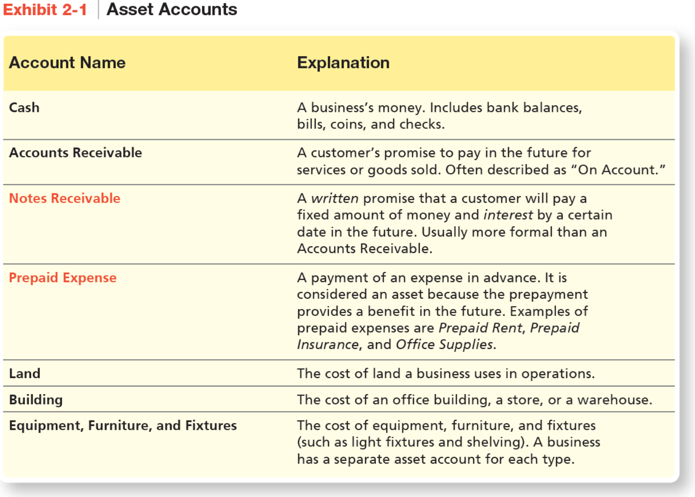{:height 367, :width 509}
- ## Liabilities
- 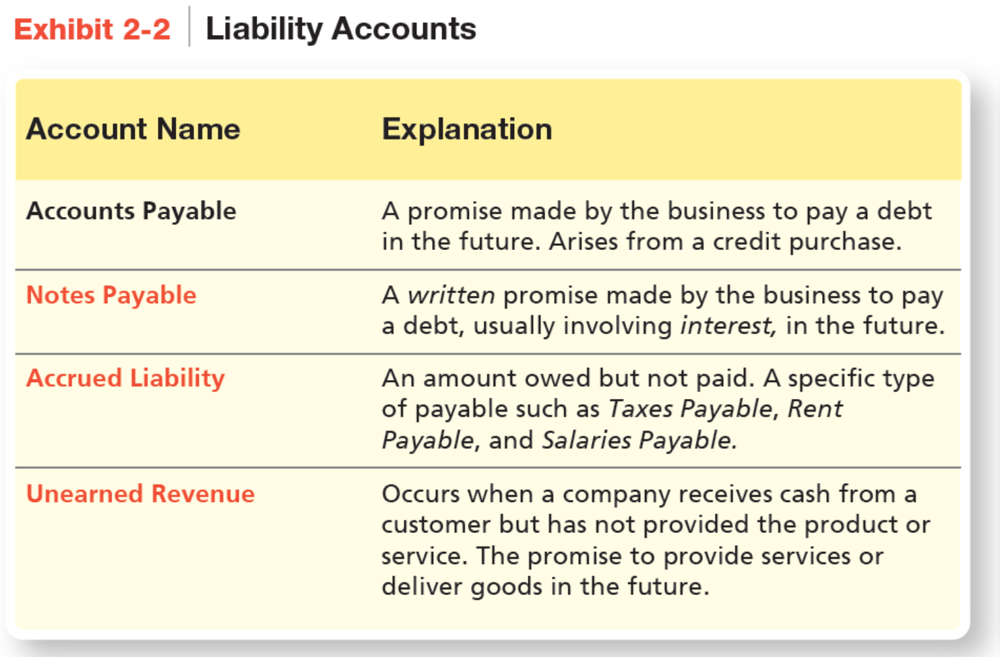{:height 374, :width 508}
- ## Equity
- 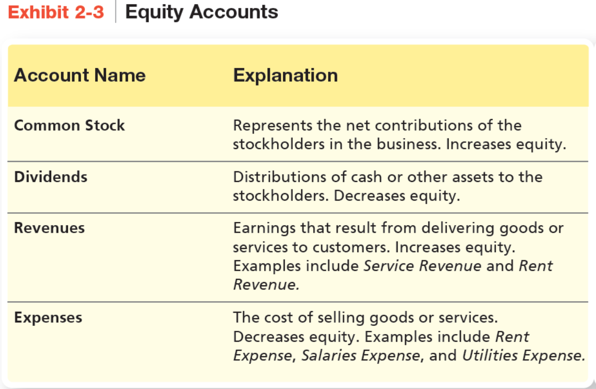{:height 383, :width 509}
- ## Chart of Accounts
- Used to organize company accounts
- Ledger is a record holding all accounts of a business and changes in those accounts
- ## Increases and Decreases in Accounts
- ((690d6c5d-d8b1-46dc-b650-52bab53324db))
- ### Expanding the rules of credit and debit
- $Assets = Liabilities + Contributed Capital + Retained Earnings$
- $Assets = Liabilities + Common Stock - Dividends + Revenues - Expenses$
- ## The Normal balance of an account
- 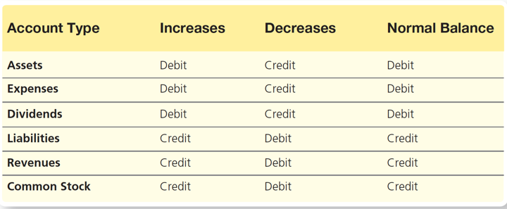
- # Journalizing and Posting Transactions
- **Step 1:** Identify the accounts and the account types (asset, liability, or equity)
- **Step 2:** Decide whether each account increases or decreases, then apply rules of debit/credit
- **Step 3:** Record the transaction in the journal
- **Step 4:** Post the journal entry to the ledger
- **Step 5:** Determine whether the accounting equation is in balance
- # Chapter 5
- ## What are Merchandising Operations?
- Business that sells merchandise, or goods, to customers/consumers
	- Merchandise that they sell is **merchandise inventory**
- Wholesaler buys goods from the manufacturer and sells them to retailers
- Retailer buys merchandise from manufacturers or a wholesaler and sells to consumers
- ### The Operating Cycle of a Merchandising Business
  
  1. Company purchases inventory from individual or business called a vendor
  2. Company sells the inventory to a customer
  3. Company collects cash from the customers
- #### Income Statement reports
- **Sales revenue** vs Service revenue
- Cost of Goods sold
- Gross profit (net sales revenue - cost of goods sold)
- Operating expenses (other than cost of goods sold)
  
  
  
  
- ### Merchandise Inventory Systems
- Businesses need to determine value of merchandise sold and on hand
- Two inventory accounting systems
	- **Periodic inventory system** requires a physical count of inventory to determine inventory on hand
	- **Perpetual inventory system** keeps a running computerized record of inventory
- #### Recording Perpetual inventory purchases
- Cycle begins with purchase of merchandise inventory
- Invoice is the seller's request for payment from purchaser
	- Also known as bills
	- Sellers have sales invoices
	- Purchasers have purchase invoices
- 
- #### Example Merchandise inventory purchasing
- |Date|Accounts and Explanation|Debit|Credit|
  |--|--|--|--|
  |Jun 3|Merchandise Inventory|35,000||
  ||Cash||35,000|
  ||Purchased inventory for cash|||
- |Date|Accounts and Explanation|Debit|Credit|
  |--|--|--|--|
  |Jun 3|Merchandise Inventory|35,000||
  ||Accounts Payable||35,000|
  ||Purchased inventory on account|||
- ### Purchase Discounts
- A discount that businesses offer to purchasers as incentive for early payment
- Credit Terms are terms of purchase or sale
	- Most credit terms express the *discount*, *discount time period*, and *final due date*
	- Example: 3/15, n/30 is a 3% discount if paid within 15 day, otherwise the full amount would be due in 30 days
- |Date|Accounts and Explanation|Debit|Credit|
  |--|--|--|--|
  |Jun 15|Accounts payable|35,000||
  ||Cash (35,000-1,050)||33,950|
  ||Merchandise Inventory (35,000 x 0.03)||1050|
  ||Paid within discount period|||
- 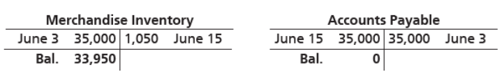
- |Date|Accounts and Explanation|Debit|Credit|
  |--|--|--|--|
  |Jun 24|Accounts payable|35,000||
  ||Cash||35,000|
  ||Paid after discount period|||
- ### Purchase Returns and Allowances
- The invoice price for a purchaser may need to be adjusted for *purchase returns or purchase allowances*
	- **Purchase returns** exist when sellers allow purchasers to return merchandise that is defective, damaged, or otherwise unsuitable
	- **Purchase allowances** are amounts granted to purchasers as an incentive to keep goods that are not as ordered
- |Date|Accounts and Explanation|Debit|Credit|
  |--|--|--|--|
  |Jun 4|Accounts payable|7,000||
  ||Merchandise Inventory (20 tablets x $350 per tablet)||7,000|
  ||Returned inventory to seller (vendor)|||
- 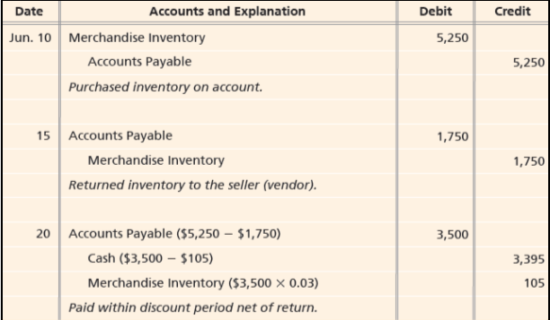
- ### Transportation Costs
- Purchase agreements specify shipping terms to determine while title of the goods transfers to purchaser and who pays the freight
	- **FOB shipping point** means the buyer takes ownership to the goods after the goods leave the sellers place of business
		- The buyer usually pays the freight
	- **FOB Destination** means the buyer takes ownership to the goods at the delivery destination point
		- Seller pays for the freight (typically)
- Merchandisers are required to pay for shipping when:
	- **Freight In** the transportation cost to ship goods into the purchasers warehouse- freight on purchased goods
	- **Freight out** the transportation cost to ship goods out the sellers warehouse and to the customer-thus it is freight on goods sold to a customer
- #### Freight in
- |Date|Accounts and Explanation|Debit|Credit|
  |--|--|--|--|
  |Jun 4|Merchandise Inventory|60||
  ||Cash||60|
  ||Paid a freight bill|||
- Freight in with discount period
	- Seller sometimes prepays the transportation cost
	- Assume Smart Touch Learning purchases $5,000 of goods, with freight charge of $400 on June 20 on account with terms of 3/5, n/30. The terms of shipment are FOB shipping point
- |Date|Accounts and Explanation|Debit|Credit|
  |--|--|--|--|
  |Jun 20|Merchandise Inventory (5,000+400)|5,400||
  ||Accounts Payable||5,400|
  ||Purchased inventory on account, including freight|||
- |Date|Accounts and Explanation|Debit|Credit|
  |--|--|--|--|
  |Jun 25|Accounts Payable|5,400||
  ||Cash (5,400-150)||5,250|
  ||Merchandise inventory (5,000x 0.03)||150|
  ||Paid within discount period, including freight|||
- #### Freight out
- |Date|Accounts and Explanation|Debit|Credit|
  |--|--|--|--|
  |Jun 21|Delivery Expense|30||
  ||Cash||30|
  ||Paid a freight bill|||
- ### Cost of Inventory Purchased
- Knowing net cost of inventory allows business to determine the cost of the merchandise purchased
- Net cost of inventory is calculated as:
	- Net Cost of Inventory Purchased = Purchase cost of inventory - Purchase returns and allowances - Purchase discounts + Freight in
	- 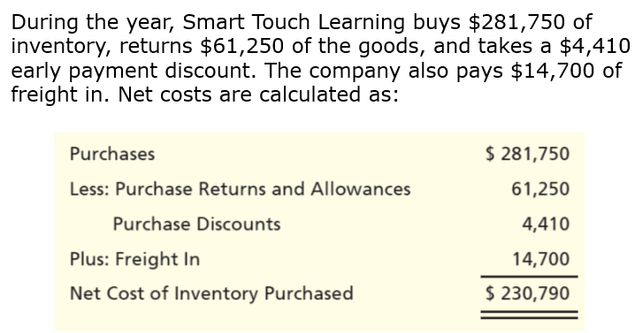{:height 305, :width 565}
- ### How Sales of Merchandise Inventory Recorded in a perpetual inventory system
- The amount a business earns from selling merchandise inventory is called from Sales Revenue
- Two entries are required to record sale transaction
	- The first entry records sales revenue and cash or accounts receiveable
	- The second entry records Cost of Goods Sold and Merchandise Inventory
- #### Sales on Account
- 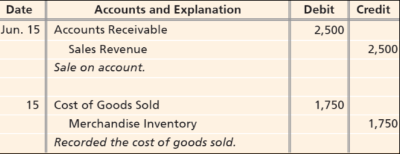
- #### Sales Discounts
- Many sellers offer customers a discount for early payment
- Sales discount are a reduction in the amount of revenue earned on sales for early payment
- Gross method
	- 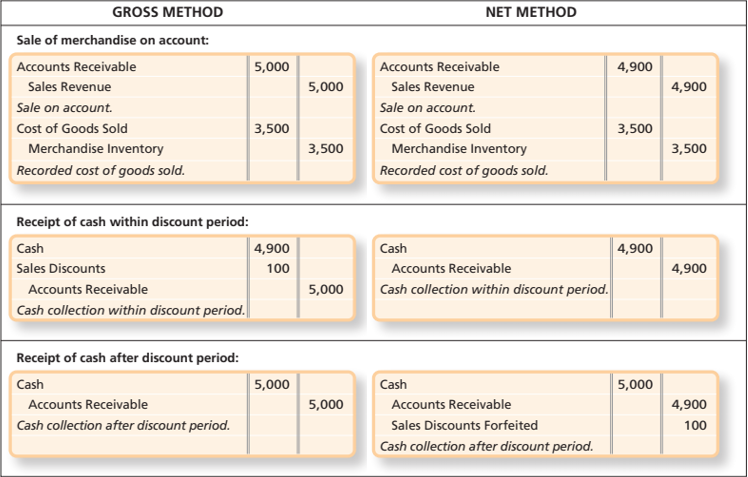{:height 303, :width 454}
	- Record all sales at the full amount (gross) and record any discounts taken at the time of payment
	- 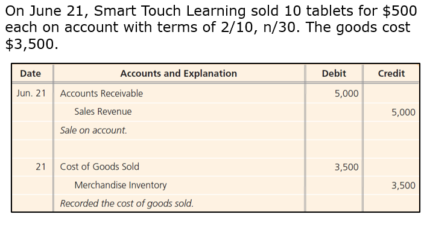{:height 247, :width 383}
	- {:height 164, :width 385}
	- 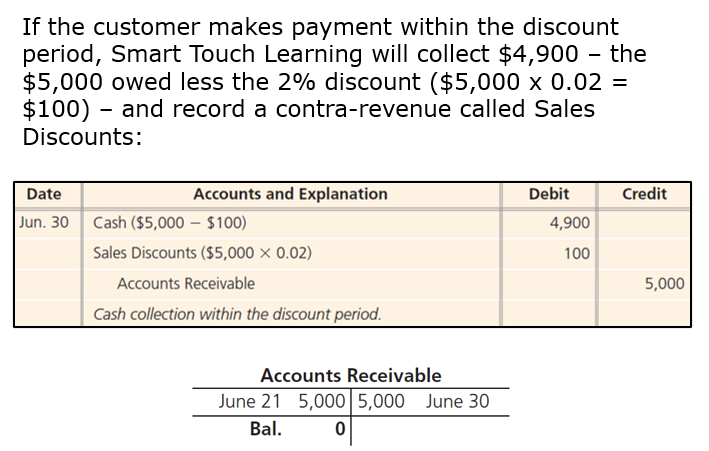{:height 267, :width 386}
	- 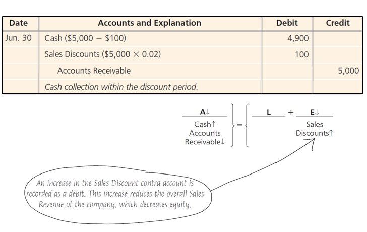{:height 342, :width 387}
- Net Method
	- Record all sales at net amount at the time of the sale and record adjustment at the time of payment for discounts not taken
- ### Adjusting and Closing entries for a merchandiser
- Actual inventory on hand may differ from the books show
	- Inventory shrinkage-loss of inventory occurring from theft, damage, and errors
- Businesses take a physical count of inventory at least once a year
- Merchandise Inventory is adjusted based on the physical count
- #### Adjusting Merchandise Inventory based on a Physical count
- 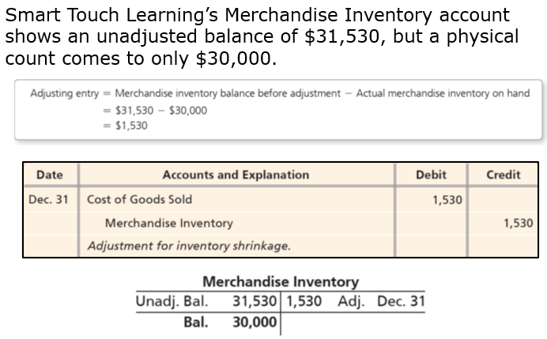{:height 341, :width 457}
-
- #### Closing the Accounts of a Merchandiser
- **Step 1:** Make the revenue accounts equal zero via the Income Summary account
- **Step 2:** Make expense accounts equal zero via the Income Summary account
- **Step 3:** Make the Income Summary account equal zero via the Retained Earnings account
	- This closing entry transfers net income (or net loss) to Retained Earnings
- **Step 4:** Make the Dividends account equal zero via the Retained Earnings account
- 
- 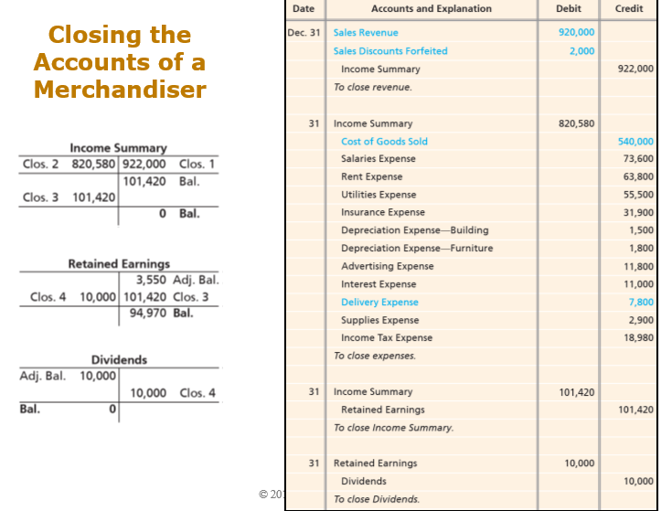{:height 398, :width 442}
- #### Merchandisers Financial Statements
- Formats for income statements
	- **Single-step income statement** groups all revenues together, lists and deducts all expenses together without calculating any subtotals
	- **Multi-step income statement** contains subtotals to highlight significant relationships
		- In addition to net income reports profit and operating income
- ##### Single-Step Income Statement
- 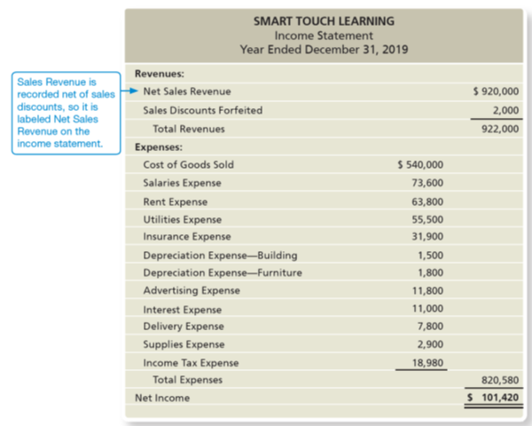{:height 437, :width 444}
- ##### Multi-Step Income Statement
- Operating expenses are reported in two categories
	- Selling expenses are related to marketing and selling the companies goods and services
	- Administrative expenses include expenses not related to marketing the companies goods and services
- Operating income = Gross Profit - Operating expenses
- Other income and expenses reports revenues or expenses that are outside normal, day-to-day operations of the business
	- Ex: Sale of plant assets to an interest expense
- Income tax expense- reports the federal and state income taxes that are incurred by the corporation
- 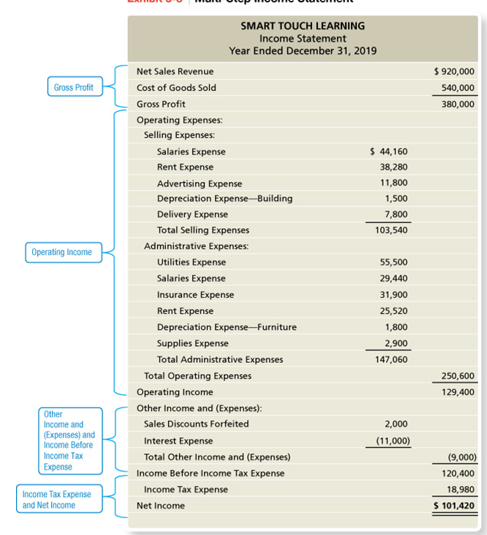{:height 456, :width 333}
- #### Statement of Retained Earnings and the Balance Sheet
- The statements of retained earnings for merchandisers and service businesses are similar
- The balance sheet for a merchandiser is a very similar except for two new asset accounts
	- Merchandise Inventory
	- Estimated Returns Inventory