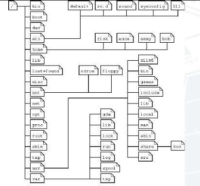
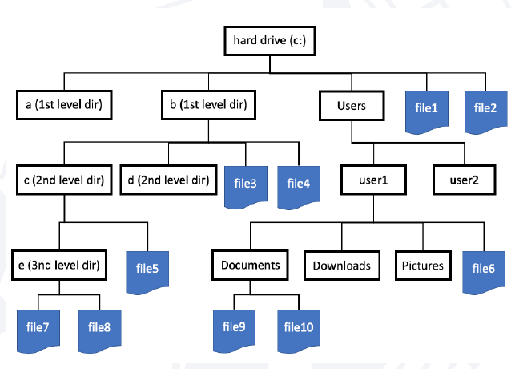
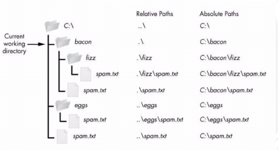
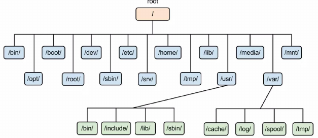
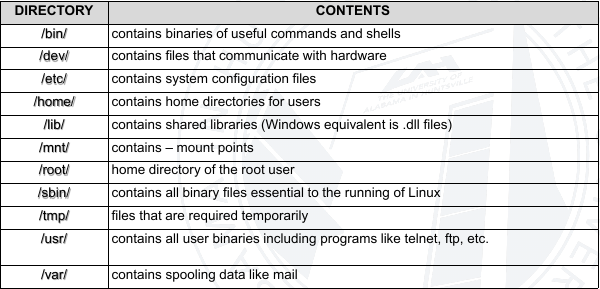
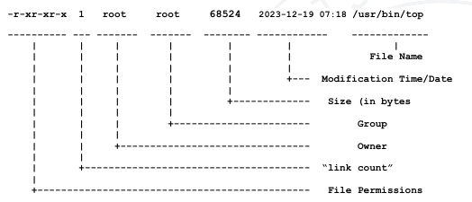
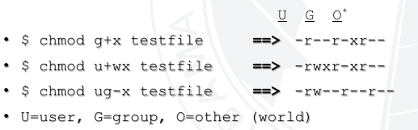
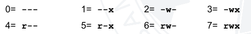
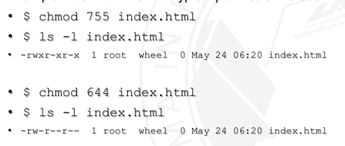

# Bash Functions and Files
- ## Functions in Bash
	- Similar to shell script
		- Stores command for execution later in memory
		- Function executed in same shell as it was called in
	- Functions must be defined before they can be referenced
	- Typically placed at beginning of script
- ```bash
  function_name(){
  	statements
  }
  ```
- ```bash
  # Simple bash function
  #!/bin/bash
  
  # Function to print a message
  say_hello(){
  	echo "Hello, world!"
  }
  # Calling the function
  say_hello
  ```
- ```bash
  # Example with an argument
  #!/bin/bash
  
  # Defined function
  greet_user(){
  	echo "Hello, $1! Welcome to the world of bash scripting!"
  }
  
  # Call the function with an argument
  greet_user "Jane"
  ```
- ## Variables in Functions
	- Variables defined within functions are global
	- Values are known throughout the entire shell program
	- Keyword 'local' inside a function definition makes the referenced variable local to that function
- ### Global and Local Variable examples
- ```bash
  global_var="Global"
  show_variable(){
  	local local_var="Local"
      echo "Inside the function"
      echo "Global variable: $global_var"
      echo "Local variable: $local_var"
  }
  show_variables
  
  echo "Outside the function:"
  echo "Global variable: $global_var"
  # The local variable is not acessible outside the function
  echo "Local variable: $local_var (not accessible)"
  ```
- ## Working with File system in Bash
	- Creating a new directory
		- mkdir DIRNAME
	- Creating a new file
		- Use text editor to create a new text file
		- Using the touch command
- ### Naming for files and Directory
	- Use Alphabetic letters
	- Numbers
	- Dot, underscore, hyphen
	- Avoid starting names with hyphens
		- Options usually start with hyphens
	- Avoid using spaces in file names
	- Avoid special letters, symbols ,etc.
- ### Copying, moving or deleting
- ```bash
  # copying
  cp [Source] [Destination]
  # move
  mv [Source] [Destination]
  # Delete
  rm FILENAME
  rm -r [Directory]
  ```
- ### Scanning files
	- **cat** - concatenate, i.e. show file contents
	- **more** - show file contents one page at a time
	- **less** -  better version of more with additional options
	- **head** - show first few lines of file
	- **tail**  - show last few lines of a file
	- **wc** - show word, line and character count
	- **sort** - sorts file contents
	- **uniq** - removes duplicates
		- sort and uniq can be combined to extract unique values or do grouping
	- **cut** - picks out columns from tabular data
	- **grep** - search file contents (next module)
		- sed and awk are more advanced
-
- # The Linux filesystem
	- Everything is a file, if not a file it is a process
	- There is basically no difference between a file and a directory
- ## Types of files
	- Most files are just regular files
	- There are the following exceptions:
		- **Directories**
		- **Special files**
		- **Links**
		- **Domain sockets**
			- Provide inter process networking protected by file system access control
		- **Named pipes**
- ### File System
	- Hierarchical - tree structure
	- Consistent
	- Simple - Flexible file operations
	- Directories are a special type of file that are lists of other programs
	- Ordered tree-like structure on the hard disk
		- {:height 364, :width 347}
		- {:height 272, :width 346}
	- Two types of paths - full/absolute paths and relative paths
		- Absolute path - complete path to a certain file or directory
			- All absolute file names start with a slash because the slash indicates the root directory
			- Slash also used for separating the directories on the path
		- Relative path- starts from the working directory
			- Need . and .. to indicate the working directory and the parent directory
			- {:height 207, :width 382}
			-
	- Your shell uses your current directory as the point of reference
- ### Basic Linux Directories
	- {:height 222, :width 486}
	- {:height 267, :width 488}
- ## File Permissions
	- Users can belong to several groups
	- A file can only belong to one user and one group at a time
	- The root user has extra permissions
		- Only the root user can change the ownership of a file
- ### Users and Groups
	- User info in /etc/passwd
	- Password info in /etc/shadow
	- Group info in /etc/group
	- /etc/passwd and /etc/group divide data fields using "."
- ## Programs
	- Programs can be run by a user, when the system starts, or by another process
	- Before starting the program, the kernel checks:
		- Is the file accessible to the user or group of the process that wants to run it?
		- Does the file containing the program permit execution by that user or group (or anybody)?
		- In most cases, a program inherits the privileges of the user/process who started it
	- 
- ## Permissions
	- Files owned by users and groups
	- Files have permissions for user, group and other (world)
	- Read, Write and Execute (R,W,X)
	- User who owns a file is always allowed to change its permissions
- ### File Permissions
	- Two ways to set permissions using the chmod command:
		- Symbolic mode:
			- 
		- Absolute mode:
			- Use octal (base 8 values)
			- R (read) = 4
			- W (write) = 2
			- X (execute) = 1
			- - (none) = 0
			- 
			- 
- #### Inherited permissions
	- Two critical points
		- Permissions of a directory affect whether someone can see its contents or add or remove files in it
		- Permissions on a file determine what a user can do to the data in the file
		- Ex:
			- If you don't have write permission for a directory, the you can't delete a file in the directory
			- If you have write access to the file you can update the data in the file