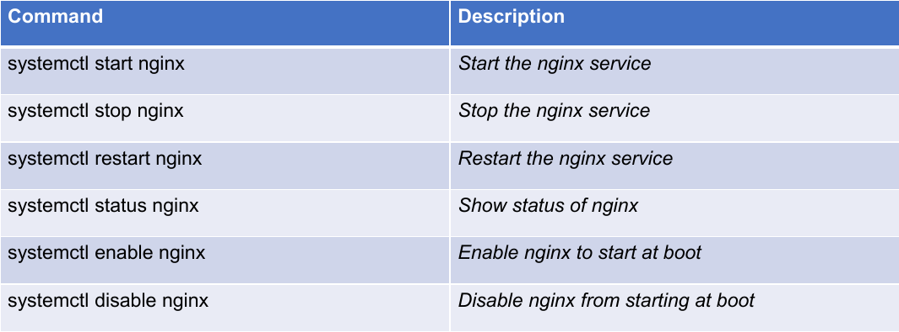
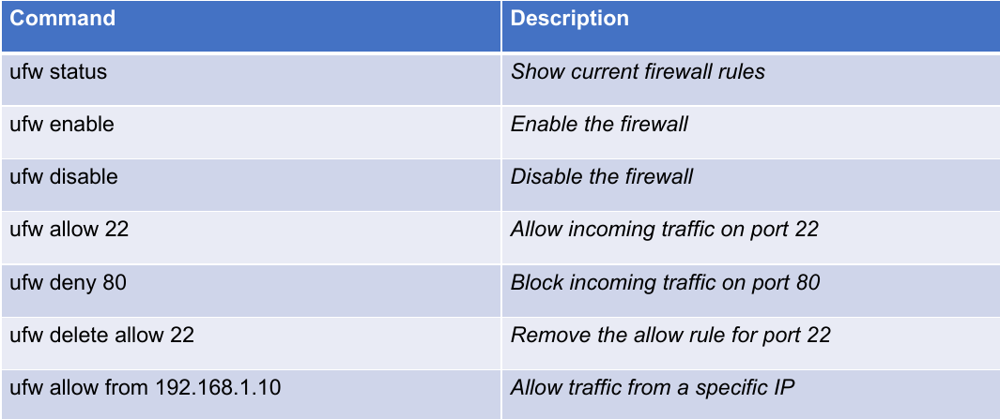
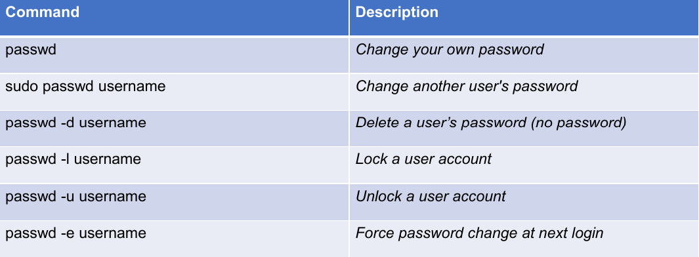
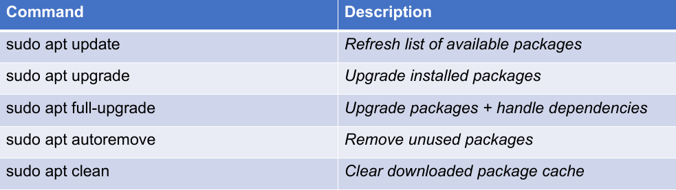
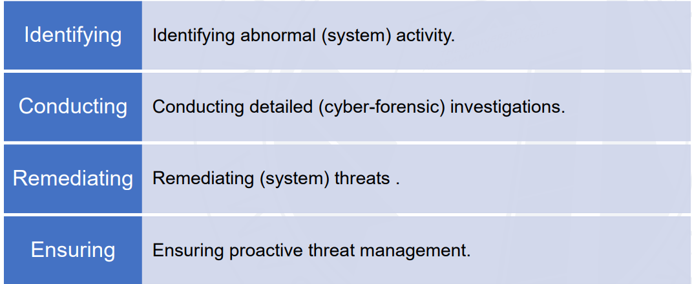
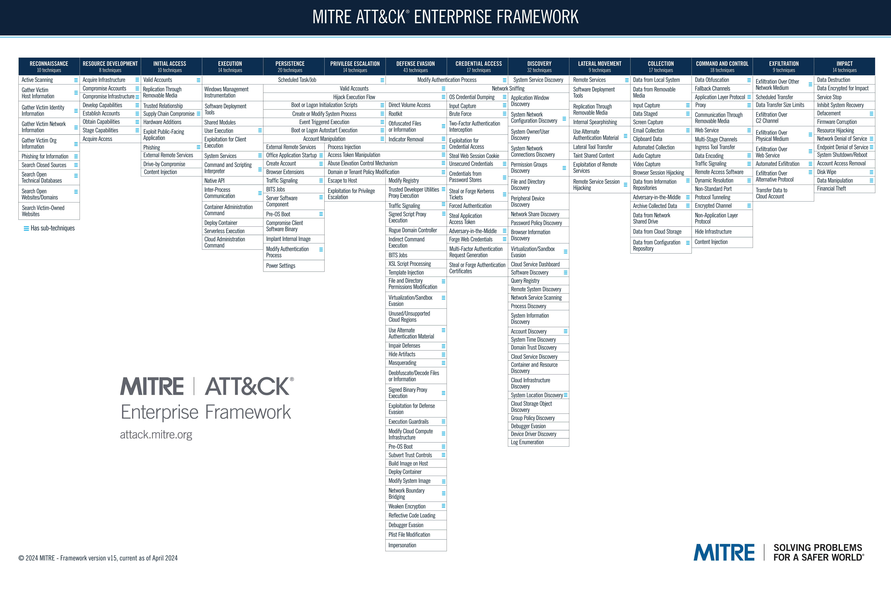
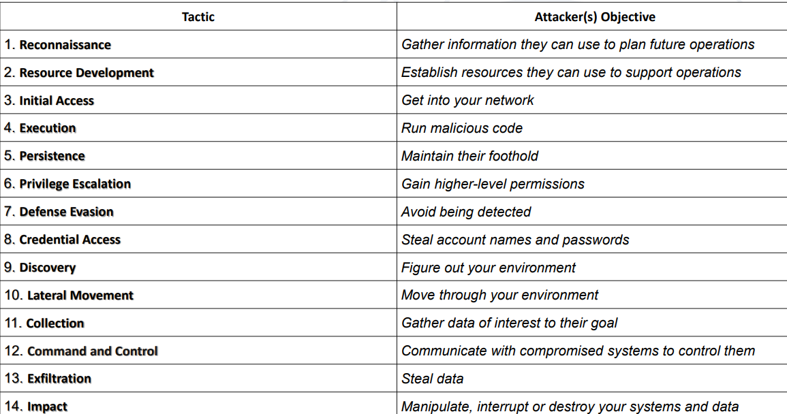
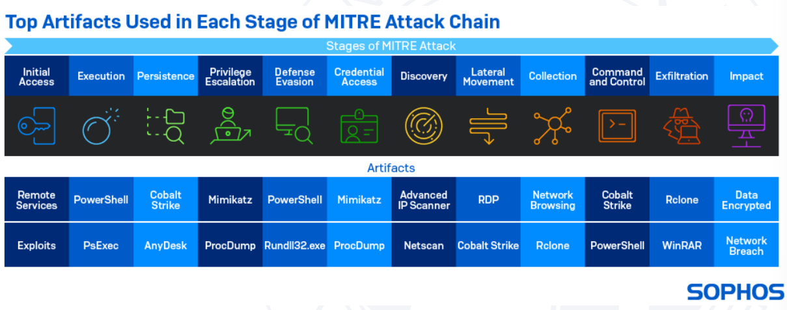

# Security Auditing and System Hardening
	- What is system hardening is **the process of securing a system by reducing its attack surface**
		- Involves disabling unnecessary services, configuring security settings, and applying updates
	- Why is it important?
		- Protects systems from unauthorized access or exploitation
		- Ensures compliance with security standards like CIS benchmarks
	- ## Key Components of System Hardening
		- SSH Security
			- Disable root login and use key-based authentication
		- Firewall configuration
			- Use tools like ufw or iptables to control incoming and outgoing traffic
		- Service Management
			- Disable unnecessary services to reduce vulnerabilities
		- Regular Updates
			- Keeps the system updated with security patches
	- ## Bash for System Hardening
		- Automates tasks like
			- Disabling services that might not be necessary
			- Updating packages
		- Ensures repeatability and consistency
		- Scripts can be scheduled via cron or other services
		- ### Using systemctl
			- For example, using systemctl:
				- ```bash
				  #!/bin/bash
				  for service in bluetooth cups avahi-daemon; do
				  systemctl stop $service
				  systemctl disable $service
				  done
				  ```
				- Used to manage system services and the system state
				- Basic syntax:
					- ```bash
					  systemctl [command] [unit]
					  command [action] #Start, stop,etc.
					  unit [systemd unit] #Like a service, ex: nginx.service
					  ```
					- {:height 235, :width 612}
	- ## Configuring Firewalls with Bash
		- **Best practices:**
			- ```bash
			  ufw default deny incoming
			  uf default allow outgoing
			  ```
			- Allow only the necessary ports
			- Turn ufw logging on
			- The ufw command
				- Simplified interface for managing iptables firewall rules
				- Basic syntax
				- ```bash
				  ufw [command] [options]
				  ```
		- 
	- ## User Account Security
		- **Best practices:**
			- Enforce strong passwords using tools like passwd
				- Enforce strong passwords (passwd)
				- Lock unused accounts (usermod -L)
				- Use chage to enforce password aging
		- The passwd command
			- Manage user passwords on Linux systems
			- Basic syntax
			- ```bash
			  # With no username, will change your own password
			  # With a username (as the root user): changes another user's password
			  passwd [options] [username]
			  ```
		- 
	- ## Filesystem Protections
		- **Key steps**
			- Remove world-writeable permissions from sensitive files
			- Configure /tmp with noexec to prevent the execution of files
				- noexec does not allow execution of any binaries on filesystem
				- Prevents accidental or malicious code execution from external drives
				- Prevents script execution from uploads
		- **Best Practices**
			- Writing a script that allows automatic updates
			- Ensures the latest security patches are applied automatically
			- 
- # Security Auditing and Advanced Scripting
	- ## Introduction to security auditing?
		- Process of evaluating a **system's security posture by identifying vulnerabilities**
			- Examples:
				- user permissions
				- file permissions
				- network configurations
		- Why is it important
			- Helps to **identify misconfigurations**
	- ## Areas for Security Auditing
		- **User accounts**
			- Check for empty passwords or unused accounts
		- **File permissions**
			- Identify world-writeable or SUID files
		- **Network configuration**
			- Verify open ports and firewall rules
		- ### Auditing User Accounts with Bash
			- **Check for:**
				- Misconfigurations
				- Risks
				- Bad practices
			- Use cases
			- Scripts to check for empty passwords
				- Parse /etc/shadow to find accounts without passwords
		- ### Auditing File Permissions
			- **Check for**
				- Weak
				- Risky
				- Misconfigured permissions
			- Use cases
			- **Find** world-writable files
				- **Find** command to locate files with insecure permissions
		- ### Auditing Network Configurations
			- **Check for**
				- Open ports
				- Misconfigurations
				- Insecure services
			- Use case
			- Scripts to list open ports- use **netstat**
		- ### Creating Audit Reports in Bash
			- Bash scripts used for automating system auditing tasks
			- Gather various pieces of information- such as:
				- System Information (OS, uptime, kernel version)
				- User Information (user accounts, active sessions)
				- File system usage (disk space, file permissions)
				- Service status (running services, open ports)
				- Security logs (failed logins, sudo usage)
			- ```bash
			  #!/bin/bash
			  echo "Security Audit Report" > audit_report.txt
			  date >> audit_report.txt
			  echo “Audit Data:" >> audit_report.txt
			  ....
			  echo "Audit report saved to audit_report.txt"
			  ```
- # Linux Threat Hunting
	- Proactive approach to identifying cyber threats
	- Be aware of the threat lanndscape
	- Detect and Respond to Cyber Threats
	- ## Why use Linux for Threat Hunting?
		- Open-source
		- Transparent
		- Granular control
	- ## Process of Threat Hunting
	- 
	- ### Threat Hunting Steps
		- Trigger
		  logseq.order-list-type:: number
			- Collect information about the environment and hypothesis
			- **Choose a trigger for further investigation**
			- Can be a system, network area, or hypothesis trigger by a vulnerability or patch or information about an exploit, security set anomalies or requests from other areas in the organization
		- Investigation
		  logseq.order-list-type:: number
			- Hunting efforts are focused on proactive searching for anomalies
				- Can prove or disprove the hypothesis
				- Assumption \rarr "We are compromised or vulnerable to this new exploit"
				- Hunters use a wide range of tech to assist them in reviewing logs and investigating anomalies
		- Resolution
		  logseq.order-list-type:: number
			- During the resolution phase, information is communicated to other teams and tools that can respond, prioritize, analyze, or store information for future use
				- **Who?** (if it involves credentials)
				- **What?** (the events that happened in order)
				- **When?** (exact timestamps for anomalies and incursions)
				- **Where?** (The scope of the affected systems, with lists of all devices and entities that will require remediation) and if possible from the evidence presented
				- **Why?** (Lack of adherence to security plan/guidelines, disgruntlement, careless, outside attack, etc.)
			- [MITRE ATT&CK framework](https://attack.mitre.org)
				- Globally accessible knowledge base of adversary tactics and techniques based on real world operations
				- 
		- 
		- 
		-